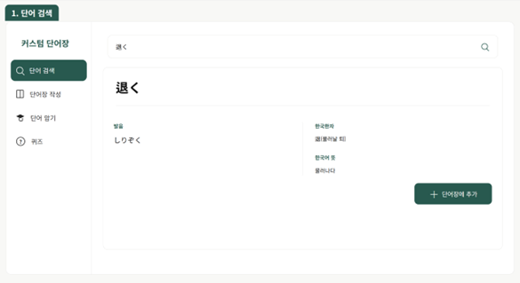
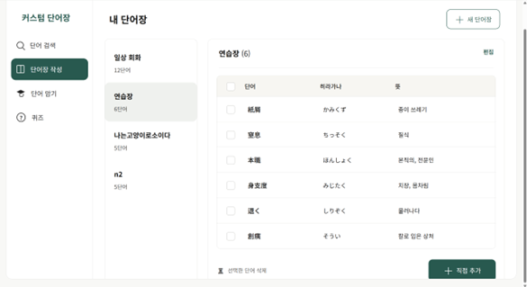
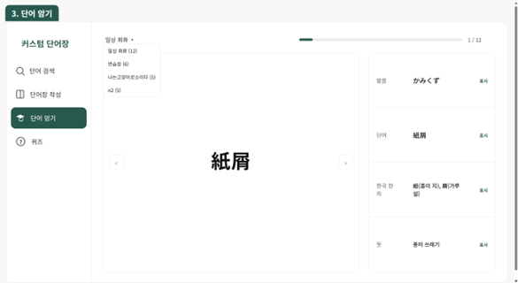
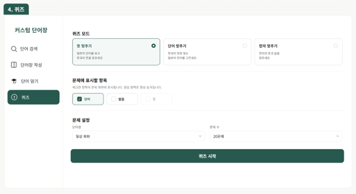
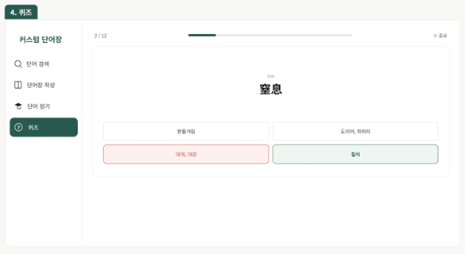

# 📚 WordBook (Word + quiz)

> **외우고 싶은 단어만, 나만의 단어장으로.**

"한자·히라가나·가타카나의 벽을 넘어, WordBook이 JLPT 단어 암기를 더 쉽게 만듭니다."

<br>

## 목차
- [프로젝트 정보](#프로젝트-정보)
- [프로젝트 소개](#프로젝트-소개)
- [주요 기능](#주요-기능-features)
- [기술 스택](#-기술-스택)
- [시스템 아키텍처](#시스템-아키텍처)
- [ERD](#erd)
- [프로젝트 구조](#프로젝트-구조)
- [회고](#회고)

<br>

## 프로젝트 정보

| 항목 | 내용 |
|---|---|
| **개발 기간** | 2026.08.25 ~ 2026.09.01 |
| **개발 인원** | 1인 (개인 프로젝트) |
| **담당** | 기획 · DB 설계 · Backend · Frontend 전체 |
| **GitHub** | [@tenyah](https://github.com/tenyah) |

<br>

## 프로젝트 소개

### 1. 기획 배경
- **Pain Point** : 일본어는 한자·히라가나·가타카나 세 가지 문자를 함께 사용해, 단어 하나를 외우려면 **표기·읽는 법·뜻**을 모두 기억해야 합니다. 시중 단어장은 정해진 순서로만 학습할 수 있어, 내가 모르는 단어만 골라 집중적으로 외우기 어렵습니다.
- **Solution** : 원하는 단어를 검색해 **나만의 단어장**에 담고, 항목을 가려가며 외우는 **플래시카드**와 힌트를 문제로 무엇을 출력할지 직접 설정하는 **퀴즈**로 반복 학습할 수 있는 웹 서비스를 제공합니다.

### 2. 주요 타겟
- **JLPT·JPT 수험생** : 시험 급수에 맞춰 단어를 체계적으로 암기해야 하는 학습자
- **한국인 일본어 학습자** : 한국 한자음(음/훈)을 활용해 일본 한자를 더 쉽게 익히고 싶은 사용자

<br>

## 주요 기능 (Features)

### 🔍 단어 검색 (Word Search)
- 단어 · 히라가나 · 한자로 검색
- 발음 · 뜻 · 한국 한자(음/훈)를 한눈에 확인
- 검색 결과에서 바로 단어장에 추가



### 📒 나만의 단어장 (My WordBook)
- 단어장 생성 · 이름 변경 · 삭제
- 사전에 없는 단어는 직접 추가 (커스텀 단어)
- 선택한 단어 일괄 삭제



### 🃏 플래시카드 암기 (Flashcard)
- 발음 · 단어 · 한국 한자 · 뜻을 **항목별로 표시/숨김**
- 가리고 싶은 부분만 가려 집중 암기



### 📝 단어 퀴즈 (Quiz)
- **뜻 / 단어 / 한자 맞추기** 3가지 모드
- 힌트로 보여줄 항목 자유 설정
- 단어장 · 문제 수 선택, 정답 확인 및 결과 표시




<br>

## 🛠 기술 스택

### Backend


### Frontend


### DB & WAS


### Tools


<br>

## 시스템 아키텍처

```
Browser ──▶ Controller (Servlet) ──▶ Service (Action) ──▶ DAO ──▶ Oracle DB
                    │
                    └──▶ JSP (View)
```

- **페이지별 Controller** : 서블릿마다 `cmd` 파라미터로 세부 동작 분기
- **공통 `Action` 인터페이스** : 모든 Service가 `process()`를 구현해 계층 구조 일관성 유지
- **DAO 재사용** : 동일한 조회 로직을 단어장 · 암기 · 퀴즈 화면에서 공유

| URL | Controller | 기능 |
|---|---|---|
| `/` | `MainController` | 메인 |
| `/WordSearch` | `WordSearchController` | 단어 검색 |
| `/WordBook` | `WordbookController` | 단어장 관리 |
| `/WordStudy` | `WordStudyController` | 단어 암기 |
| `/WordQuiz` | `WordQuizController` | 퀴즈 |

<br>

## ERD


| 테이블 | 설명 |
|---|---|
| `WORD` | 정식 제공 단어 (word, huri, mean, kanji, kormean, korsound) |
| `CUSTOM_WORD` | 사용자가 직접 추가한 단어 (`WORD`와 동일 구조) |
| `WORDBOOK` | 사용자가 생성한 단어장 (id, name) |
| `WORD_WORDBOOK` | 단어장-단어 연결 테이블, `word_type`으로 출처(`W`/`C`) 구분 |

<br>

## 프로젝트 구조

```
WordBook/
├── src/main/
│   ├── java/com/mnu/wordbook/
│   │   ├── controller/        # 기능별 Servlet (Main, WordSearch, Wordbook, WordStudy, WordQuiz)
│   │   ├── service/           # Action 인터페이스 + 기능별 비즈니스 로직
│   │   │   ├── wordsearch/    # 단어 검색
│   │   │   ├── wordbook/      # 단어장 생성·수정·삭제, 단어 추가·삭제
│   │   │   ├── wordstudy/     # 플래시카드 암기
│   │   │   └── wordquiz/      # 퀴즈 출제·채점
│   │   ├── model/             # DAO / DTO (Word, WordBook, QuizQuestion)
│   │   └── util/              # DBManager (DB 연결)
│   └── webapp/
│       ├── common/            # 공통 사이드바
│       ├── css/               # 스타일시트
│       ├── wordsearch/        # 단어 검색 화면
│       ├── wordbook/          # 단어장 화면
│       ├── wordstudy/         # 암기 화면
│       ├── wordquiz/          # 퀴즈 화면
│       └── WEB-INF/lib/       # ojdbc8, JSTL 라이브러리
└── README.md
```

<br>

## 회고

- **MVC 구조에 대한 이해** : Controller-Service-DAO 패턴을 4개 기능에 반복 적용하며 계층 분리에 대한 이해도 향상
- **DAO 재사용으로 개발 효율 향상** : 동일한 조회 로직을 단어장 · 암기 · 퀴즈 화면에서 공유
- **정식 단어 + 커스텀 단어 통합 조회** : `UNION` 쿼리로 `WORD`와 `CUSTOM_WORD`를 하나의 결과로 합쳐, 화면에서는 출처 구분 없이 동일하게 다룰 수 있도록 구현

<br>

---
Copyright © 2026 본인이름. All rights reserved.
